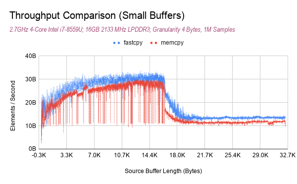
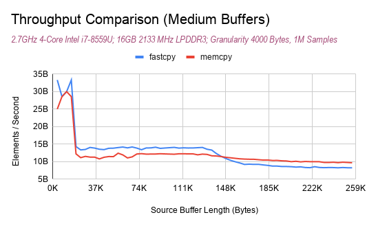

# Fastcpy

A simple header-only alternative to `memcpy`, which can be significantly faster depending on copy size.

Example:

```c
#include "fastcpy.h"

// ...

fastcpy((char*)destination, (const char*)input, number_of_bytes);
```

Performance is determined by input buffer size, and *on my machine* is `2^14` = `16kb`:



There is interesting behavior as the input buffer size grows:



## What's going on?
Writing a simple for loop is faster than memcpy for smaller input sizes.  This could be for a number of reasons:

- The loop can be auto-vectorized by a supporting compiler, if the target architechture provides suitable vector instructions.
	- Distributions of the C standard library (where the implementation of `memcpy` lives) (in my experience) do not include support for vector instructions. This might be for compatibility reasons, or maybe the tradeoff of runtime support and alignment detection doesn't make sense for the standard libraries, who knows.
	- Distributions of the C standard library may have been compiled using older compilers that leave optimizations on the table, again, who knows.

Note that when I say the C standard library, I mean the shared object files which contain the actual symbols and machine code which correspond to functions like `memcpy`.

